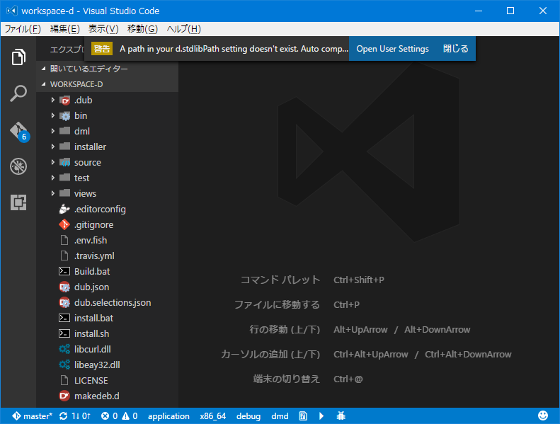
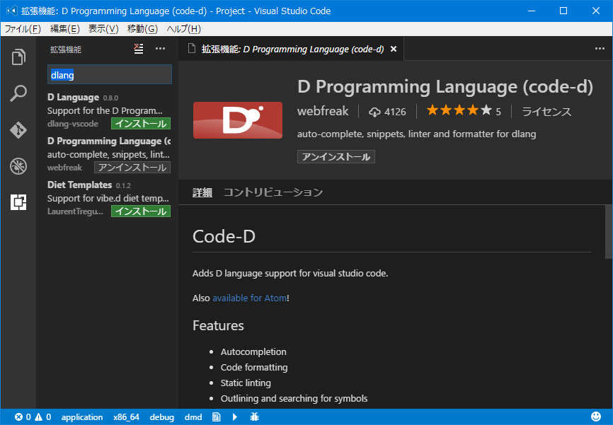
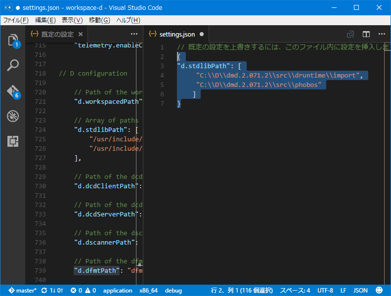

## Visual Studio CodeのＤ言語拡張機能を使ってみた(Windows)

Visual Studio Code(VSCode) Ｄ言語拡張機能のインテリセンス/オートコンプリートは、とても良い感じです。
EmacsのFlycheckように呼び出し先の関数やテンプレートの定義も見る事ができます。
多少うるさいです、たとえばパブリックな識別子にドキュメントがないぞ！とか、クラス名がガイドラインから外れているとか...

"A path in your d.stdlibPath setting doesn't exist."

settings.json
// 既定の設定を上書きするには、このファイル内に設定を挿入します
{
"d.stdlibPath": [
     "C:\\D\\dmd.2.071.2\\src\\druntime\\import",
     "C:\\D\\dmd.2.071.2\\src\\phobos"
    ]
}

tag: dlang,VSCode,Visual Studio Code
filename: template_md
last update: 2015/03/

